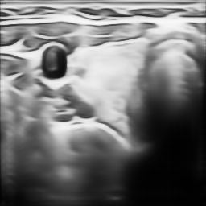

# Text to Image- UltraGAN

This project implements a method to automatically generate ultrasound images from Chinese ultrasound reports. The implementation idea of UltraGAN is as follows.


## 使用方法：

- To making your own dataset

  ```
  cd data_preprocessing
  python making_dataset.py
  ```

- To train the UltraGen

  ```
  python main.py
  ```

- To evaluate the model

  ```
  python predict.py
  ```

- To change config of the network

  ```
  You can change the config of the network in config.py
  ```

## Datasets

Due to the concerns of patient privacy in the design of the dataset, it cannot be open sourced. You can use other report image datasets instead, such as IUXray. You can download the images' file through  https://openi.nlm.nih.gov/.

## Resources

```
cudatoolkit=11.1.1
python=3.8.11
pytorch=1.9.0=py3.8_cuda11.1_cudnn8_0
scikit-learn=0.23.2
scipy=1.6.2
seaborn=0.11.2
yacs=0.1.8
yaml=0.2.5
```

## some experimental results

You can download the result from [here](https://drive.google.com/file/d/1BUXFfaD-IlURyujtXZMJQ9IVhdIqKc3a/view?usp=sharing)





## Acknowledgments

The implementation of Self-guided Framework is mainly based on [XRayGAN](https://arxiv.org/abs/2006.10552). We thanks the authors for their efforts.

